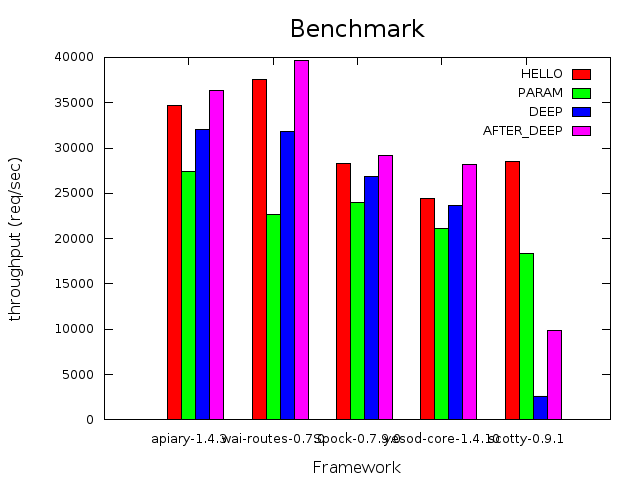

[Wai-Routes](https://ajnsit.github.io/wai-routes)    
====================================

This package provides typesafe URLs for Wai applications.

Features
==========

  - Automatic generation of Route boilerplate using TH
  - Easy Nested Routes
  - Subsites
  - General purpose Route Attributes/Annotations
  - Sitewide Master datatype which is passed to all handlers
    and can be used for persistent data (like DB connections)
  - RouteM monad that makes it easy to compose an application
    with multiple routes and middleware.
  - HandlerM monad that makes it easy to build a Handler
    with access to Request data and Master datatype
  - Handlers can abort processing and pass control to the next
    application in the wai stack

The aim is to provide a similar level of typesafe URL functionality to Wai applications as is available to Yesod applications.

Performance
===========

When it comes to performance, Wai-routes compares quite favorably with other Haskell web development micro frameworks.

See more details here - [philopon/apiary-benchmark](https://github.com/philopon/apiary-benchmark)

Example Usage
=============

Wai-routes comes with several examples in the `examples/` directory. New examples are being added regularly.

**Example 1. Hello World** - [Code](examples/hello-world)

A simple hello-world web app with two interlinked pages. This provides the simplest example of using routing and linking between pages with typesafe routes.

**Example 2. Hello World with Subsites** - [Code](examples/subsites)

Similar functionality as the first example, but uses a hello world subsites to provide the hello world functionality. A subsite is an independently developed site that can be embedded into a parent site as long as the parent site satisfies a particular api contract. It's easy to swap out subsites for different functionality as long as the api contract remains constant.

**Example 3. Using Blaze-HTML to generate HTML** - [Code](examples/blaze-html)

A simple example of how to generate HTML using blaze-html combinators in your handlers.

**Example 4. Using Shakespearean Templates (hamlet, cassius, lucius, julius) to generate HTML/CSS/JS** - [Code](examples/shakespeare)

A simple example of how to generate HTML/CSS/JS using shakespearean templates. You can use both external and inline templates.

**Example 5. Building a JSON REST Service** - [Code](examples/rest-json)

Provides a simple example of how to build JSON REST services with wai-routes. Uses Aeson for JSON conversion. Note that this example just demonstrates the web facing side of the application. It doesn't permanently persist data, and is also not threadsafe. You must use a more robust data storage mechanism in production! An example of doing this with a Relational DB adapter (like persistent) is in the works.

Planned Features
====================

The following features are planned for later releases -

- Add support for streaming responses (see http://hackage.haskell.org/package/wai-3.0.3.0/docs/Network-Wai.html#v:responseStream)
- Add support for raw network responses (see http://hackage.haskell.org/package/wai-3.0.3.0/docs/Network-Wai.html#v:responseRaw)
- Development mode
- Keter and Heroku support
- Scaffolding
- Better documentation
- Tests and code coverage

Changelog
=========

* 0.7.2 : Added 'file' to send a raw file directly, 'rawBody' and 'jsonBody' to consume request body. Refactored RouteM to add 'catchAll' and 'waiApp'.
* 0.7.1 : Added 'showRouteQuery', renamed 'text' to 'plain', 'html' now accepts Text instead of ByteString
* 0.7.0 : Subsites support added
* 0.6.2 : Added 'maybeRoute' and 'routeAttrSet', to get information about the currently executing route
* 0.6.1 : Fixed cabal and travis files
* 0.6.0 : Removed dependency on yesod-routes. Updated code to compile with wai-3 and ghc-7.8, ghc-7.10
* 0.5.1 : Bumped dependency upper bounds to allow text 1.*
* 0.5.0 : Added raw,text,html,json helpers. Update to wai-2.1.
* 0.4.1 : showRoute now returns "/" instead of ""
* 0.4.0 : Wai 2 compatibility. Replaced 'liftResourceT' with 'lift'
* 0.3.4 : Added 'liftResourceT' to lift a ResourceT into HandlerM
* 0.3.3 : Better exports from the Network.Wai.Middleware.Routes module
* 0.3.2 : Added HandlerM Monad which makes it easier to build Handlers
* 0.3.1 : Removed internal 'App' synonym which only muddied the types. Added common content types for convenience.
* 0.3.0 : yesod-routes 1.2 compatibility. Abstracted request data. Created `runNext` which skips to the next app in the wai stack
* 0.2.4 : Put an upper bound on yesod-routes version as 1.2 breaks API compatibility
* 0.2.3 : Implemented a better showRoute function. Added blaze-builder as a dependency
* 0.2.2 : Fixed license information in hs and cabal files
* 0.2.1 : Changed license to MIT
* 0.2   : Updated functionality based on yesod-routes package
* 0.1   : Intial release
